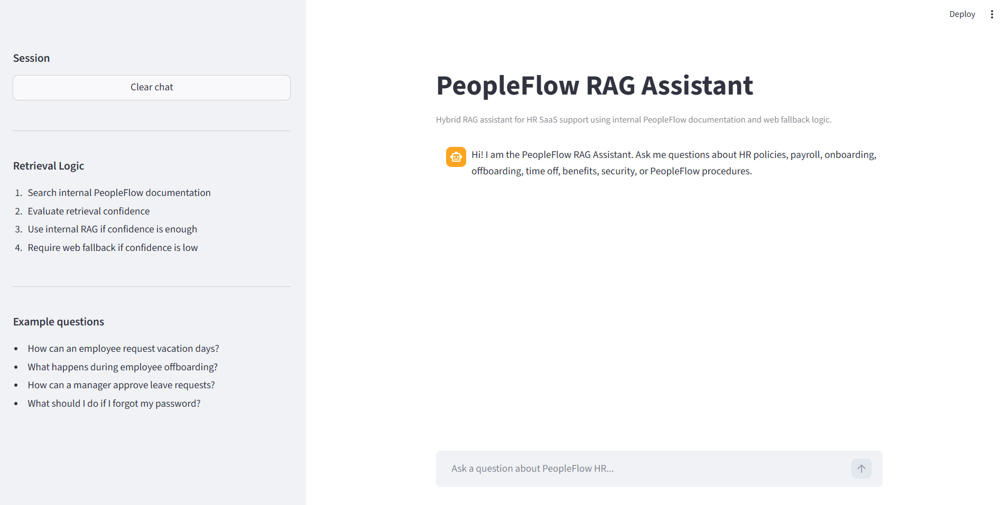
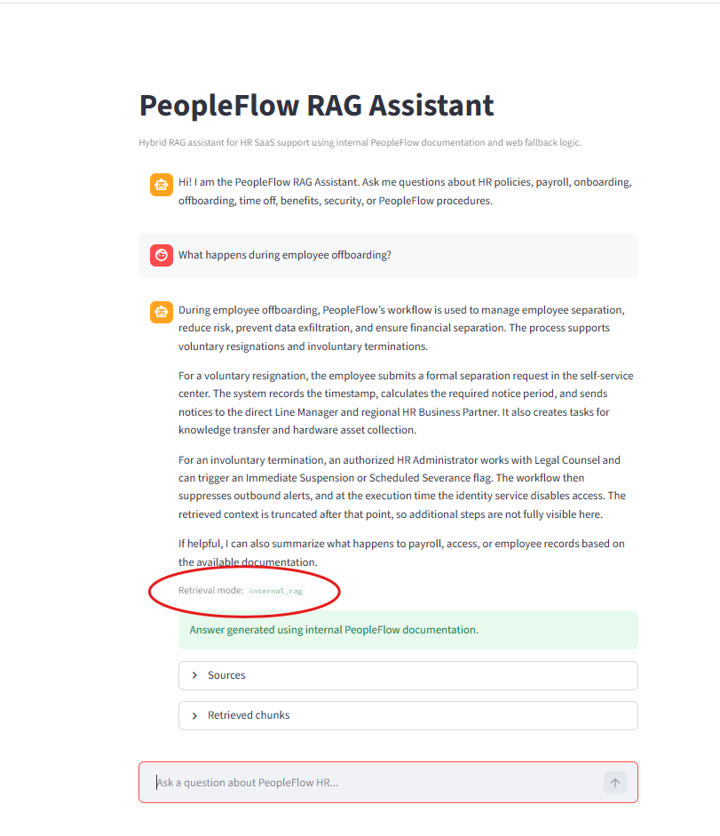
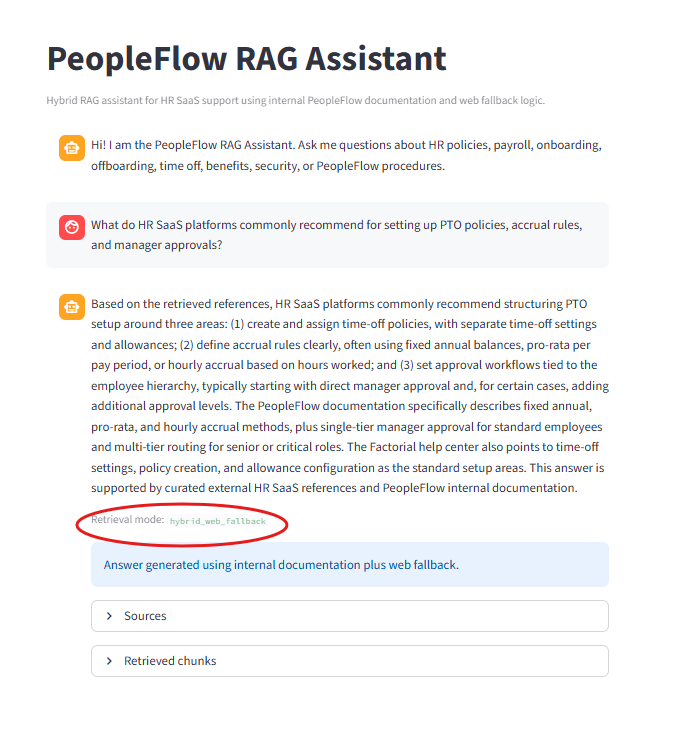
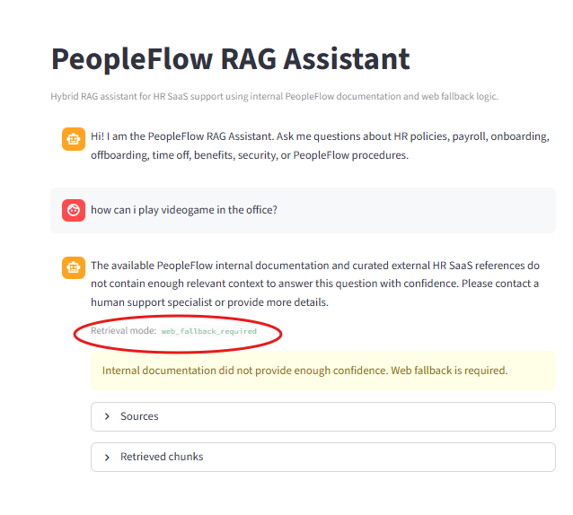
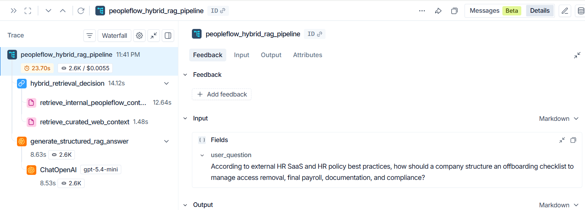
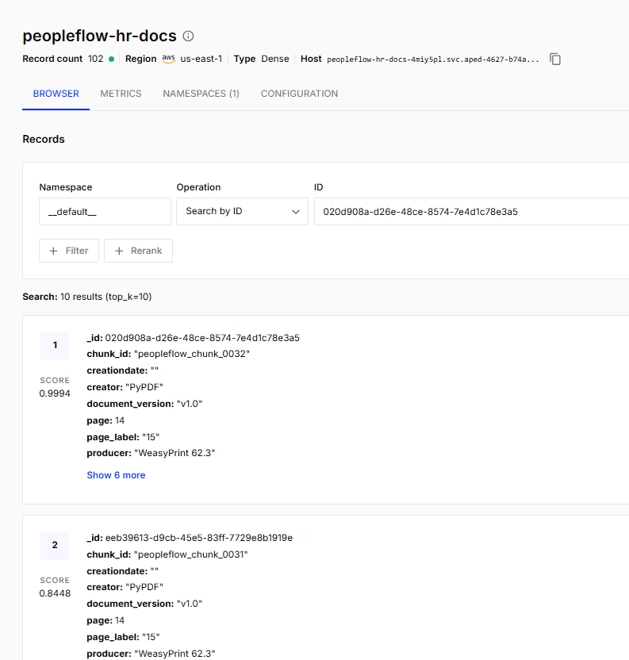
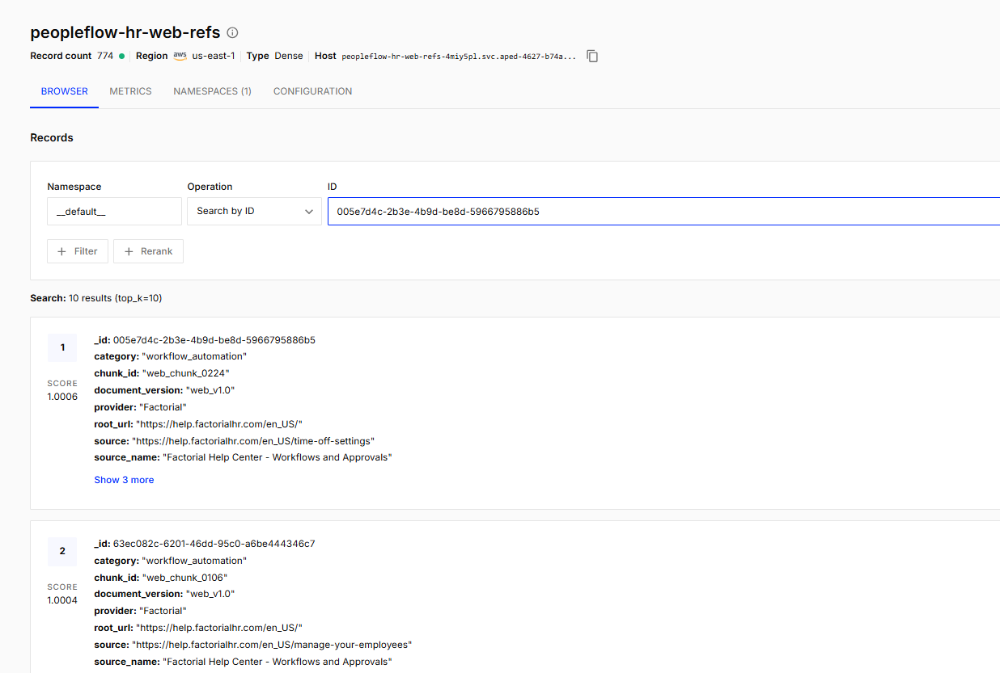

# 🧠 PeopleFlow RAG Assistant

**PeopleFlow RAG Assistant** is a production-style **Hybrid Retrieval-Augmented Generation (RAG)** system designed for an HR SaaS environment.

The assistant answers employee and customer support questions by retrieving trusted information from:

1. **Internal PeopleFlow documentation** stored as PDF-based chunks.
2. **Curated external HR SaaS and HR policy web references** ingested from trusted sources.
3. **A provider-flexible LLM layer**, allowing OpenAI, xAI/Grok, or DeepSeek to generate structured answers using the same retrieved context.

The system is designed for transparency, traceability, and extensibility. Every answer returns a structured JSON payload including the user question, the generated answer, retrieval mode, and related chunks used as evidence.

---

## 📌 Project Purpose

HR SaaS support teams often receive repeated questions about:

* Time off requests
* Vacation policies
* Payroll workflows
* Employee onboarding
* Employee offboarding
* Approval workflows
* Benefits
* HR operations
* Internal procedures
* General HR policy references

Instead of manually searching internal documentation or relying only on an LLM's general knowledge, this project implements a **Hybrid RAG architecture** that retrieves relevant context before generating an answer.

---

## 🧩 High-Level Architecture

```text
User Question
    ↓
PeopleFlow Hybrid Retriever
    ↓
Internal PeopleFlow PDF Retriever
    ↓
Internal Score Evaluation
    ↓
If internal score is strong enough:
    → internal_rag
    → Generate answer from internal documentation

If internal score is weak:
    → Curated Web Retriever
    ↓
If web context is relevant:
    → hybrid_web_fallback
    → Generate answer from curated external HR SaaS references

If neither internal nor web context is enough:
    → web_fallback_required
    → Return controlled fallback response
```

---

## 🧠 Retrieval Modes

The system can return three retrieval modes:

### **1. `internal_rag`**

Used when the internal PeopleFlow documentation provides strong enough context.

```json
{
  "retrieval_mode": "internal_rag"
}
```

### **2. `hybrid_web_fallback`**

Used when internal context is weak, but curated external HR SaaS or HR policy references provide useful context.

```json
{
  "retrieval_mode": "hybrid_web_fallback"
}
```

### **3. `web_fallback_required`**

Used when neither internal documentation nor curated web knowledge provides enough relevant information.

```json
{
  "retrieval_mode": "web_fallback_required"
}
```

---

## 🏗️ Core Features

### ✅ **Internal PDF RAG**

Processes internal PeopleFlow documentation by:

* Loading PDF content
* Splitting it into semantic chunks
* Enriching chunk metadata
* Creating embeddings
* Storing vectors in Pinecone
* Retrieving relevant chunks by similarity score

Internal knowledge is stored in:

```text
peopleflow-hr-docs
```

---

### ✅ **Curated Web Knowledge Ingestion**

The project also ingests trusted HR SaaS and HR policy references from curated sources using:

* Tavily Map
* Tavily Extract
* Seed URLs
* Keyword filtering
* Metadata enrichment
* Pinecone batch uploads

External curated web knowledge is stored in:

```text
peopleflow-hr-web-refs
```

This separation avoids mixing internal company documentation with external web references.

---

### ✅ **Separate Pinecone Indexes**

The project uses two Pinecone indexes:

```text
peopleflow-hr-docs       → Internal PeopleFlow PDF documentation
peopleflow-hr-web-refs   → Curated external HR SaaS and HR policy references
```

This improves:

* Retrieval quality
* Debugging
* Source separation
* Explainability
* Future scalability

---

### ✅ **Hybrid Retriever**

The hybrid retriever follows an internal-first strategy:

```text
1. Search internal PeopleFlow documentation
2. Evaluate best similarity score
3. If internal score >= threshold → internal_rag
4. If internal score < threshold → search curated web index
5. If web score is relevant → hybrid_web_fallback
6. If web score is weak → web_fallback_required
```

The internal threshold currently used is:

```python
MIN_INTERNAL_SCORE = 0.50
```

The web retriever also filters low-relevance results using:

```python
MIN_WEB_SCORE = 0.50
```

---

### ✅ **Multi-Provider LLM Support**

The generation layer supports different LLM providers using a provider selector.

Supported providers:

* OpenAI
* xAI / Grok
* DeepSeek

The provider is selected through:

```env
LLM_PROVIDER=openai
```

Available options:

```text
openai
xai
deepseek
```

This allows testing the same retrieval context with different models.

---

### ✅ **Structured JSON Output**

Every final answer is returned as structured JSON:

```json
{
  "user_question": "How can an employee request vacation days?",
  "system_answer": "Employees can request vacation days by...",
  "retrieval_mode": "internal_rag",
  "chunks_related": [
    {
      "chunk_id": "peopleflow_chunk_0024",
      "source_type": "internal_pdf",
      "source_name": "PeopleFlow HR Knowledge Base",
      "provider": null,
      "category": null,
      "source_url": null,
      "page": 9,
      "score": 0.5584,
      "content_preview": "When an employee submits a vacation request..."
    }
  ]
}
```

This improves:

* Traceability
* Debugging
* Auditability
* Frontend rendering
* Evaluation

---

### ✅ **Streamlit Chat Interface**

The project includes a Streamlit UI that allows users to:

* Ask HR-related questions
* View generated answers
* See retrieval mode
* Inspect related chunks
* Review source metadata
* Compare internal and web fallback behavior

Run with:

```bash
uv run streamlit run main.py
```

---

### ✅ **LangSmith Tracing**

The project supports LangSmith tracing using:

```env
LANGCHAIN_TRACING_V2=true
LANGCHAIN_PROJECT=peopleflow-rag-assistant
```

Important traced components include:

```text
peopleflow_hybrid_rag_pipeline
hybrid_retrieval_decision
retrieve_internal_peopleflow_context
retrieve_curated_web_context
generate_structured_rag_answer
```

Example trace structure:

```text
peopleflow_hybrid_rag_pipeline
├── hybrid_retrieval_decision
│   ├── retrieve_internal_peopleflow_context
│   └── retrieve_curated_web_context
└── generate_structured_rag_answer
```

---

## 🖼️ Screenshots

Create this folder:

```bash
mkdir -p assets/screenshots
```

Recommended screenshot names:

```text
assets/screenshots/01-streamlit-home.png
assets/screenshots/02-internal-rag-response.png
assets/screenshots/03-hybrid-web-fallback.png
assets/screenshots/04-web-fallback-required.png
assets/screenshots/05-langsmith-tracing.png
assets/screenshots/06-pinecone-internal-index.png
assets/screenshots/07-pinecone-web-index.png
```

Add them to the README using:

### **Streamlit Home**



---

### **Internal RAG Response**



---

### **Hybrid Web Fallback**



---

### **Controlled Fallback Response**



---

### **LangSmith Tracing**



---

### **Pinecone Internal Index**



---

### **Pinecone Web Index**



---

## 🛠️ Tech Stack

| Layer             | Technology                      |
| ----------------- | ------------------------------- |
| Language          | Python                          |
| Package Manager   | uv                              |
| UI                | Streamlit                       |
| LLM Orchestration | LangChain                       |
| Tracing           | LangSmith                       |
| Vector Database   | Pinecone                        |
| Embeddings        | OpenAI `text-embedding-3-small` |
| Web Extraction    | Tavily Map + Tavily Extract     |
| LLM Providers     | OpenAI, xAI/Grok, DeepSeek      |
| Validation        | Pydantic                        |
| Retrieval Pattern | Hybrid RAG                      |

---

## 📁 Project Structure

```text
peopleflow-rag-assistant/
├── backend/
│   ├── config/
│   │   └── settings.py
│   │
│   ├── generation/
│   │   ├── answer_generator.py
│   │   ├── llm_factory.py
│   │   └── prompt_builder.py
│   │
│   ├── ingestion/
│   │   ├── text_splitter.py
│   │   ├── web_loader.py
│   │   └── web_metadata_enricher.py
│   │
│   ├── retrieval/
│   │   ├── hybrid_retriever.py
│   │   ├── internal_retriever.py
│   │   ├── web_retriever.py
│   │   └── web_sources.py
│   │
│   ├── schemas/
│   │   └── rag_schema.py
│   │
│   ├── vectorstore/
│   │   └── pinecone_store.py
│   │
│   └── core.py
│
├── scripts/
│   ├── ingest_pdf.py
│   ├── web_ingestion_pipeline.py
│   ├── test_internal_retrieval.py
│   ├── test_web_retriever.py
│   └── test_hybrid_retrieval.py
│
├── assets/
│   └── screenshots/
│
├── main.py
├── logger.py
├── pyproject.toml
├── uv.lock
├── .env.example
├── .gitignore
└── README.md
```

---

## ⚙️ Environment Variables

Create a `.env` file in the root directory.

Use `.env.example` as a template:

```bash
cp .env.example .env
```

Never commit your real `.env`.

---

## 🔐 Security Warning

Do not commit:

```text
.env
.venv/
__pycache__/
*.pyc
```

Your `.gitignore` should include:

```gitignore
.env
.env.*
.venv/
__pycache__/
*.pyc
.pytest_cache/
```

---

## 📦 Installation

### **1. Clone the repository**

```bash
git clone https://github.com/juanmabaal/peopleflow-rag-assistant.git
cd peopleflow-rag-assistant
```

### **2. Install dependencies with uv**

```bash
uv sync
```

### **3. Activate the virtual environment**

On Windows PowerShell:

```powershell
.venv\Scripts\Activate
```

On macOS/Linux:

```bash
source .venv/bin/activate
```

### **4. Create your `.env` file**

```bash
cp .env.example .env
```

Then fill in your real API keys.

---

## 🧬 Pinecone Setup

Create two Pinecone indexes:

### **Internal PDF Index**

```text
peopleflow-hr-docs
```

### **Curated Web Index**

```text
peopleflow-hr-web-refs
```

Recommended configuration:

```text
dimension: 1536
metric: cosine
```

This matches:

```env
EMBEDDING_MODEL=text-embedding-3-small
```

---

## 📄 Internal PDF Ingestion

The internal PeopleFlow documentation should be ingested into:

```text
peopleflow-hr-docs
```

Run:

```bash
uv run python -m scripts.ingest_pdf
```

Expected behavior:

```text
Load internal PDF
↓
Split into chunks
↓
Enrich metadata
↓
Upload to Pinecone internal index
```

---

## 🌐 Curated Web Ingestion

The curated web ingestion uses:

```text
Tavily Map
↓
Keyword filtering
↓
Seed URLs
↓
Tavily Extract
↓
Chunking
↓
Metadata enrichment
↓
Batch upload to Pinecone web index
```

Run:

```bash
uv run python -m scripts.web_ingestion_pipeline
```

Expected target index:

```text
peopleflow-hr-web-refs
```

Example successful output:

```text
Documents loaded: 34
Chunks indexed: 774
Target index: peopleflow-hr-web-refs
```

---

## 🔎 Test Internal Retrieval

Run:

```bash
uv run python -m scripts.test_internal_retrieval
```

Example questions:

```text
How can an employee request vacation days?
What happens during employee offboarding?
What should I do if I forgot my password?
```

---

## 🌐 Test Web Retrieval

Run:

```bash
uv run python -m scripts.test_web_retriever
```

Example questions:

```text
What are common HR best practices for designing a vacation leave policy?
How should a company structure an offboarding workflow to reduce operational and security risks?
What are common approval workflow best practices for employee time-off requests?
```

Expected mode when used through the full pipeline:

```text
hybrid_web_fallback
```

---

## 🧠 Test Hybrid Retrieval

Run:

```bash
uv run python -m scripts.test_hybrid_retrieval
```

Expected decisions:

```text
Strong internal match       → internal_rag
Weak internal + good web    → hybrid_web_fallback
Weak internal + weak web    → web_fallback_required
```

---

## 🚀 Run the Core Pipeline

Run:

```bash
uv run python -m backend.core
```

The core pipeline tests examples such as:

```text
How can an employee request vacation days?
What are common HR policies for vacation leave?
What is the best programming language for video games?
```

Expected behavior:

| Question Type                   | Expected Retrieval Mode |
| ------------------------------- | ----------------------- |
| Internal PeopleFlow question    | `internal_rag`          |
| General HR SaaS/policy question | `hybrid_web_fallback`   |
| Out-of-domain question          | `web_fallback_required` |

---

## 💬 Run Streamlit UI

Run:

```bash
uv run streamlit run main.py
```

Open:

```text
http://localhost:8501
```

Try these questions:

```text
How can an employee request vacation days?
```

```text
What are common HR best practices for designing a vacation leave policy?
```

```text
What is the best programming language for video games?
```

---

## 🧪 Example Questions

### **Internal RAG**

```text
How can an employee request vacation days?
```

```text
How can a manager approve leave requests?
```

```text
What happens during employee offboarding?
```

### **Hybrid Web Fallback**

```text
What are common HR best practices for designing a vacation leave policy?
```

```text
How should a company structure an offboarding workflow to reduce operational and security risks?
```

```text
What are common approval workflow best practices for employee time-off requests?
```

### **Controlled Fallback**

```text
What is the best programming language for video games?
```

```text
How do I cook pasta?
```

---

## 🧭 Main Pipeline Flow

```text
run_rag_pipeline()
    ↓
retrieve_hybrid_context()
    ↓
retrieve_internal_context()
    ↓
Check internal best score
    ↓
If internal score >= threshold:
    → generate_rag_answer()
    → internal_rag
    ↓
Else:
    → retrieve_web_context()
    ↓
    If web chunks found:
        → generate_rag_answer()
        → hybrid_web_fallback
    Else:
        → generate_fallback_required_answer()
        → web_fallback_required
```

---

## 🧠 Prompting Strategy

The project uses a controlled RAG prompt that instructs the model to:

* Use only retrieved context
* Avoid inventing PeopleFlow policies
* Distinguish internal documentation from external web references
* Return valid JSON
* Preserve traceability through `chunks_related`

The prompt explicitly handles:

```text
internal_rag
hybrid_web_fallback
web_fallback_required
```

---

## 📊 Similarity Scores

The retrievers use Pinecone similarity search through:

```python
similarity_search_with_score()
```

Scores are used to determine whether context is relevant enough.

Current thresholds:

```python
MIN_INTERNAL_SCORE = 0.50
MIN_WEB_SCORE = 0.30
```

These thresholds can be adjusted after empirical testing.

---

## 🔭 LangSmith Observability

If enabled, LangSmith traces help inspect:

* User question
* Retrieval decision
* Internal retriever
* Web retriever
* LLM generation
* Final structured output

Required environment variables:

```env
LANGCHAIN_TRACING_V2=true
LANGCHAIN_API_KEY=your_langsmith_api_key
LANGCHAIN_PROJECT=peopleflow-rag-assistant
```

---

## 🧱 SOLID-Oriented Design

The project separates responsibilities by module:

| Component               | Responsibility                         |
| ----------------------- | -------------------------------------- |
| `core.py`               | Main orchestration                     |
| `hybrid_retriever.py`   | Retrieval decision logic               |
| `internal_retriever.py` | Search internal PDF index              |
| `web_retriever.py`      | Search curated web index               |
| `web_loader.py`         | Load and extract curated web documents |
| `pinecone_store.py`     | Pinecone vector store utilities        |
| `answer_generator.py`   | Generate structured JSON answers       |
| `prompt_builder.py`     | Build controlled RAG prompts           |
| `rag_schema.py`         | Validate response structure            |

---

## ⚖️ Trade-Offs

### **Advantages**

* Clear internal vs external source separation
* Structured and auditable JSON output
* Multi-provider LLM support
* Pinecone-based scalable retrieval
* LangSmith tracing
* Streamlit interface
* Extensible architecture

### **Current Limitations**

* Web ingestion may include noisy chunks from public websites
* Some sources may block or limit extraction
* Similarity thresholds require empirical tuning
* Web chunks can become outdated and should be refreshed periodically
* No advanced reranking layer yet
* No automated evaluation agent yet

---

## 🚧 Future Improvements

Planned improvements:

* Add reranking before generation
* Add automated evaluator agent
* Add scheduled web re-ingestion
* Add duplicate chunk detection
* Add namespace support or index cleanup scripts
* Add metrics for latency, token usage and cost
* Add FastAPI endpoint
* Add authentication for production deployment
* Add Docker support
* Add CI/CD tests
* Add a README demo video or GIF

---

## 🧑‍💻 Author

**Juan Manuel Balaguera Alvira**

AI Engineer in training
Petroleum Engineer transitioning into AI Engineering, QA and LLM systems
Focused on RAG pipelines, LLM applications, AI agents, vector databases and production-style AI systems.

---

## ⭐ Key Takeaway

This project demonstrates how to move from a basic LLM chatbot to a **Hybrid RAG Assistant** with:

* Internal private knowledge
* Curated external knowledge
* Vector search
* Multi-provider LLM generation
* Structured JSON outputs
* Traceability
* Streamlit UI
* LangSmith observability
* Scalable architecture

PeopleFlow RAG Assistant is designed as a foundation that can later evolve into a production-grade HR SaaS support assistant.
